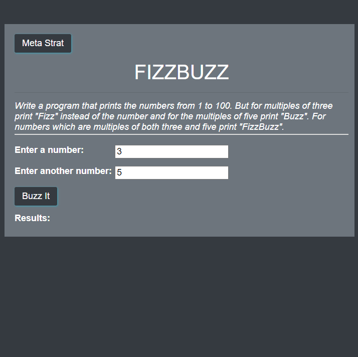
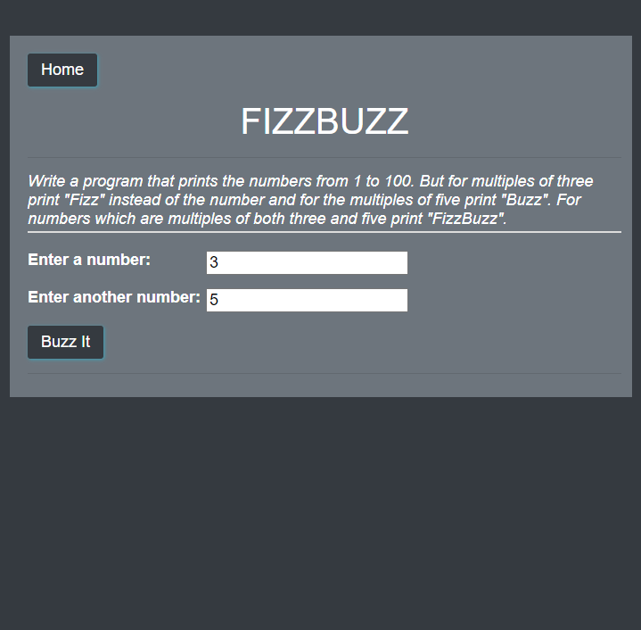

# FIZZBUZZ

## Description

Created an application that prints the numbers from 1 to 100. But for
multiples of three print "Fizz" instead of the number and for the
multiples of five print "Buzz". For numbers which are multiples of
both three and five print "FizzBuzz".

### Example imgage

## Table of contents

- [Description](#Description)
- [Licence](#Licence)
- [Contributors](#Contributors)
- [Test](#Test)
- [Repository Link](#Repository)
- [Live Link](#Live)
- [GitHub Info](#GitHub)

## Licence

## Contributors

Thank for Coder Foundry for the video that I followed for help with FizzBuzz.

- [Coder Foundry](https://www.youtube.com/watch?v=Qb5owKFFn-g)

## Test

no test

## Repository

- [https://github.com/Feizhi255/FIZZBUZZ](https://github.com/Feizhi255/FIZZBUZZ)

## Live

- [feizhi255.github.io/FIZZBUZZ](https://feizhi255.github.io/FIZZBUZZ/)

## GitHub

- Jordan Kirby
- [Feizhi255](https://github.com/Feizhi255)

## Questions? Send me an email

- <jrock255@hotmail.com>
