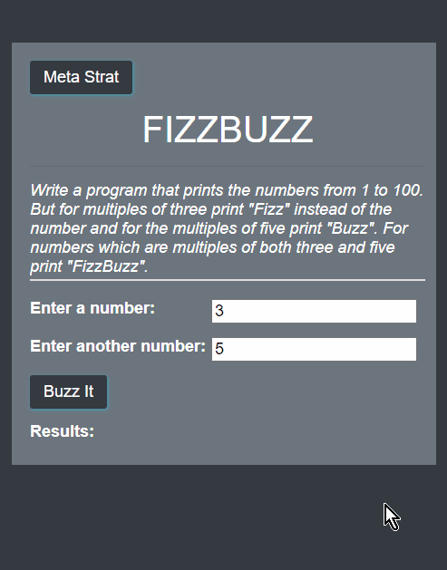

# FIZZBUZZ

## Description

Created an application that prints the numbers from 1 to 100. But for
multiples of three print "Fizz" instead of the number and for the
multiples of five print "Buzz". For numbers which are multiples of
both three and five print "FizzBuzz".

### Exapmle gif

## Table of contents

- [Description](#Description)
- [Code](#Code)
- [Contributors](#Contributors)
- [Test](#Test)
- [Repository Link](#Repository)
- [Live Link](#Live)
- [GitHub Info](#GitHub)

## Code

Inside the fizzbuzz.js you will find 4 different ways this code was writtten. On line 73 change FizzBuzzA with FizzBuzzB, or FizzBuzzC to change the differnet call function. 

    // Call and use our FizzBuzz
    function buzzIt() {
     let output = "";
     let val1 = document.getElementById("Fizzvalue").value;
     let val2 = document.getElementById("Buzzvalue").value;
     output = **FizzBuzzA**(val1, val2);
     document.getElementById("results").innerHTML = output;
    }

FizzBuzzD has its own call function inside line 78 buzzItTemplate line 91.

    // Call and use our template
    function buzzItTemplate() {
     let output = [];
     let headTemplate = document.getElementById("template-header");
     let rowTemplate = document.getElementById("template-row-items");

     let templateHTML = rowTemplate.innerHTML;
     let resultsHTML = headTemplate.innerHTML;

     // Get the values the user entered
     let val1 = document.getElementById("Fizzvalue").value;
     let val2 = document.getElementById("Buzzvalue").value;

     // Call out fizzbuzz function
     output = **FizzBuzzD**(val1, val2);
      for (i = 1; i < output.length; i += 5) {
       resultsHTML += templateHTML
        .replace("{{val1}}", output[i])
        .replace("{{val2}}", output[i + 1])
        .replace("{{val3}}", output[i + 2])
        .replace("{{val4}}", output[i + 3])
        .replace("{{val5}}", output[i + 4]);
     }
     document.getElementById("results").innerHTML = resultsHTML;
    }

## Contributors

Thank for Coder Foundry for the video that I followed for help with FizzBuzz.

- [Coder Foundry](https://www.youtube.com/watch?v=Qb5owKFFn-g)

## Test

no test

## Repository

- [https://github.com/Feizhi255/FIZZBUZZ](https://github.com/Feizhi255/FIZZBUZZ)

## Live

- [feizhi255.github.io/FIZZBUZZ](https://feizhi255.github.io/FIZZBUZZ/)

## GitHub

- Jordan Kirby
- [Feizhi255](https://github.com/Feizhi255)

## Questions? Send me an email

- <jrock255@hotmail.com>
